# Mixer Vibration Monitoring AI Agent

교반구동장치의 진동 시계열 데이터를 분석하고, 현재 데이터 상태를 기반으로 자연어 질의응답을 제공하는 제조 데이터 기반 AI Agent입니다.

사용자는 웹 화면에서 진동 데이터를 조회·추가·수정·삭제할 수 있으며, 현재 저장된 데이터를 기반으로 생성된 분석 Summary를 AI에게 질문할 수 있습니다.

---

## 1. 프로젝트 개요

일반적인 생성형 AI는 사용자가 보유한 제조 데이터를 직접 알지 못합니다.

본 프로젝트는 교반구동장치에서 수집된 진동 데이터를 분석하여 주요 특징을 추출하고, 이를 Firestore에 저장한 뒤 현재 데이터 상태를 실시간으로 요약합니다.

생성된 Summary는 GPT의 System Prompt에 Context로 전달되며, 사용자는 자연어로 현재 진동 수준이나 최근 변화에 대해 질문할 수 있습니다.

### 전체 데이터 처리 흐름

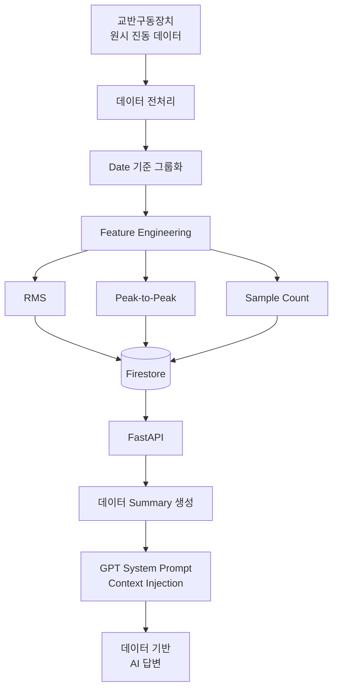

핵심은 원시 진동 데이터를 그대로 GPT에 전달하는 것이 아니라, 제조 데이터를 먼저 분석하고 요약한 뒤 AI가 이해할 수 있는 Context로 제공한다는 점입니다.

---

## 2. 주요 기능

### 2.1 데이터 기반 AI Chat

현재 Firestore에 저장된 진동 데이터를 분석하여 Summary를 생성하고, 이를 GPT의 System Prompt에 삽입하여 데이터 기반 답변을 제공합니다.

예시 질문:

- 최근 교반기의 진동 수준은 평소보다 높은가?
- 최근 진동은 증가하고 있는가?
- RMS가 가장 낮았던 구간은 언제인가?
- 최근 3시간 동안 진동 변화는 어떠한가?
- 현재 Peak-to-Peak 값은 전체 데이터에서 어느 수준인가?

AI는 제공된 데이터 Summary를 기준으로 답변하며, 데이터로 확인할 수 없는 고장 원인이나 설비 이상을 임의로 확정하지 않도록 구성했습니다.

---

### 2.2 제조 데이터 CRUD

사용자는 웹 화면에서 측정 데이터를 직접 관리할 수 있습니다.

지원 기능:

- 데이터 추가
- 데이터 조회
- 데이터 수정
- 데이터 삭제
- 데이터 변경 후 Summary 자동 갱신

기본 데이터 구조:

```json
{
  "date": "2021-11-20T07:48:34.533Z",
  "value": 2.7149,
  "memo": "교반구동장치 진동 측정",
  "peak_to_peak": 17.8828,
  "sample_count": 1024
}
```

`value`는 진동 데이터에서 계산된 RMS 값을 사용합니다.

---

### 2.3 데이터 Summary

현재 Firestore에 저장된 데이터를 기반으로 주요 통계 및 최근 추세를 계산합니다.

| 분석 항목 | 설명 |
|---|---|
| 분석 기간 | 현재 저장된 데이터의 시작 및 종료 시각 |
| 데이터 개수 | 분석에 사용된 측정 데이터 수 |
| 평균 RMS | 전체 RMS 평균 |
| 중앙값 RMS | 전체 RMS 중앙값 |
| 최소 / 최대 RMS | 전체 데이터의 RMS 범위 |
| 최신 RMS | 가장 최근 측정 RMS |
| RMS Percentile Rank | 최신 RMS의 전체 데이터 내 상대적 위치 |
| 평균 대비 차이 | 최신 RMS와 전체 평균의 차이 |
| 최근 3시간 추세 | 단기 진동 변화 |
| 최근 6시간 추세 | 중기 진동 변화 |
| Peak-to-Peak | 최신 진동 진폭 범위 |
| P2P Percentile Rank | 최신 P2P의 전체 데이터 내 상대적 위치 |

Summary 응답 예시:

```json
{
  "equipment": "mixing_actuator",
  "value_metric": "RMS",
  "rms": {
    "average": 2.4588,
    "median": 2.638,
    "latest": 2.7149,
    "percentile_rank": 58.18
  },
  "trend": {
    "short_term_3h": {
      "direction": "decrease"
    },
    "mid_term_6h": {
      "direction": "increase"
    }
  }
}
```

Percentile Rank는 고장 확률을 의미하지 않습니다. 현재 보유 데이터 내에서 해당 측정값이 어느 수준에 위치하는지를 나타냅니다.

---

### 2.4 대화 기록

AI와의 대화 내용을 Firestore에 저장합니다.

지원 기능:

- 대화 자동 저장
- 이전 대화 목록 조회
- 이전 대화 불러오기
- 대화 삭제
- 새 대화 시작
- Multi-turn Conversation

이전 대화를 불러온 경우 기존 메시지 Context를 포함하여 다음 질문을 처리할 수 있습니다.

---

## 3. 제조 데이터 분석

원본 데이터는 교반구동장치에서 수집된 Z축 진동 센서 데이터입니다.

원시 데이터는 동일 측정 시각에 다수의 진동 샘플을 포함하고 있으므로 측정 시각인 `Date`를 기준으로 그룹화하여 특징값을 생성했습니다.

### Feature Engineering 과정

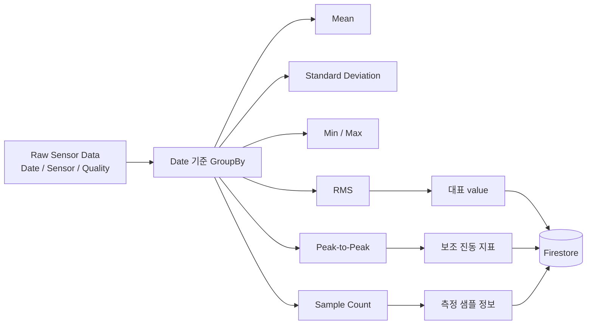

### 주요 Feature

| Feature | 설명 |
|---|---|
| RMS | 진동 신호의 전체적인 크기 수준을 나타내는 대표 지표 |
| Peak-to-Peak | 진동 신호의 최대값과 최소값의 차이 |
| Sample Count | 해당 측정 시각의 특징 계산에 사용된 원본 샘플 수 |
| Mean | 진동 신호 평균 |
| Standard Deviation | 진동 신호 표준편차 |
| Min | 최소 센서값 |
| Max | 최대 센서값 |

서비스에서 사용하는 대표 `value` 값은 RMS입니다.

원시 진동 데이터를 그대로 AI에 전달하는 것이 아니라 제조 데이터를 먼저 통계적으로 처리하고, 분석 결과를 AI가 해석할 수 있는 형태로 변환하는 구조를 사용했습니다.

---

## 4. AI Context Injection

이 프로젝트의 핵심 기능입니다.

사용자가 질문하면 FastAPI 서버는 현재 Firestore 데이터를 조회하고 Summary를 생성합니다.

생성된 Summary를 GPT의 System Prompt에 삽입한 뒤 사용자 질문과 함께 AI API를 호출합니다.

### AI Chat 처리 과정

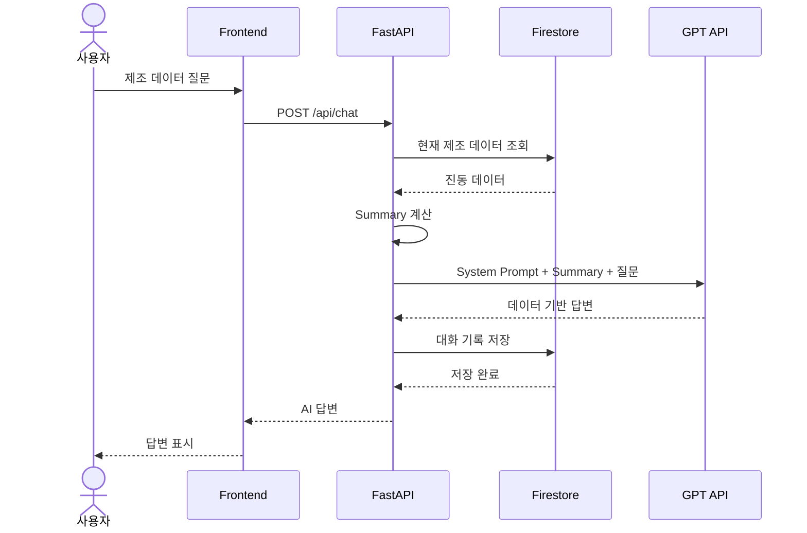

이 방식을 통해 AI가 일반적인 답변만 생성하는 것이 아니라 현재 저장되어 있는 제조 데이터의 상태를 반영하여 답변할 수 있도록 구현했습니다.

데이터가 추가·수정·삭제되면 이후 AI 요청에서 사용되는 Summary 역시 변경된 데이터를 기준으로 다시 계산됩니다.

---

## 5. 기술 스택

| 영역 | 기술 |
|---|---|
| Backend | Python, FastAPI, Pydantic, Pandas, Uvicorn |
| AI | GPT API, Codyssey OpenAI-compatible API |
| Frontend | HTML, CSS, Vanilla JavaScript, Fetch API |
| Database | Google Firebase Firestore |
| Backend Deployment | Render |
| Frontend Deployment | Vercel |
| Version Control | Git, GitHub |

---

## 6. 시스템 아키텍처

전체 서비스는 Frontend, Backend, Database, AI API로 분리되어 있습니다.

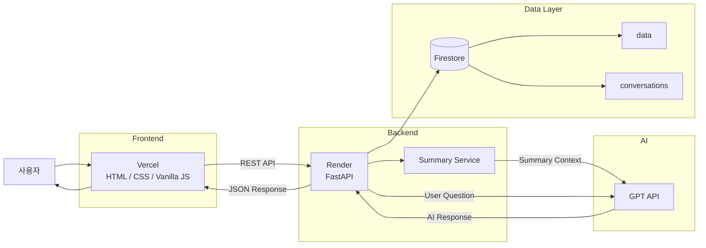

### 구성 요소 역할

| 구성 요소 | 역할 |
|---|---|
| Vercel | HTML/CSS/Vanilla JavaScript Frontend 서비스 |
| Render | FastAPI Backend 서비스 |
| Firestore | 제조 데이터 및 대화 기록 저장 |
| Summary Service | 제조 데이터 통계 및 최근 추세 계산 |
| GPT API | 제조 데이터 Summary 기반 자연어 응답 생성 |

---

## 7. 배포 주소

### Frontend

https://mixer-vibration-ai-frontend.vercel.app

### Backend

https://mixer-vibration-ai.onrender.com

### Swagger API Documentation

https://mixer-vibration-ai.onrender.com/docs

---

## 8. REST API

### 전체 API 구성

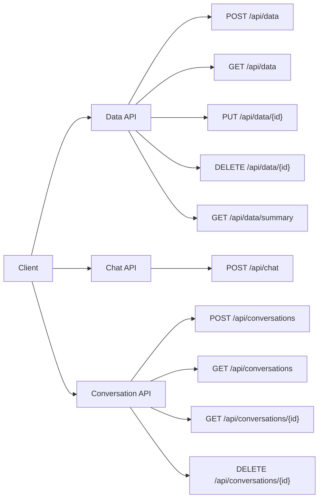

### Data API

| Method | Endpoint | 기능 |
|---|---|---|
| POST | `/api/data` | 데이터 추가 |
| GET | `/api/data` | 데이터 목록 조회 |
| PUT | `/api/data/{id}` | 데이터 수정 |
| DELETE | `/api/data/{id}` | 데이터 삭제 |
| GET | `/api/data/summary` | 현재 데이터 Summary 조회 |

### Conversation API

| Method | Endpoint | 기능 |
|---|---|---|
| POST | `/api/conversations` | 대화 저장 |
| GET | `/api/conversations` | 대화 목록 조회 |
| GET | `/api/conversations/{id}` | 특정 대화 조회 |
| DELETE | `/api/conversations/{id}` | 대화 삭제 |

### Chat API

| Method | Endpoint | 기능 |
|---|---|---|
| POST | `/api/chat` | 제조 데이터 기반 AI Chat |

전체 API 명세 및 테스트는 Swagger UI에서 확인할 수 있습니다.

---

## 9. 데이터 저장 구조

Firestore는 제조 데이터와 AI 대화 기록을 분리하여 관리합니다.

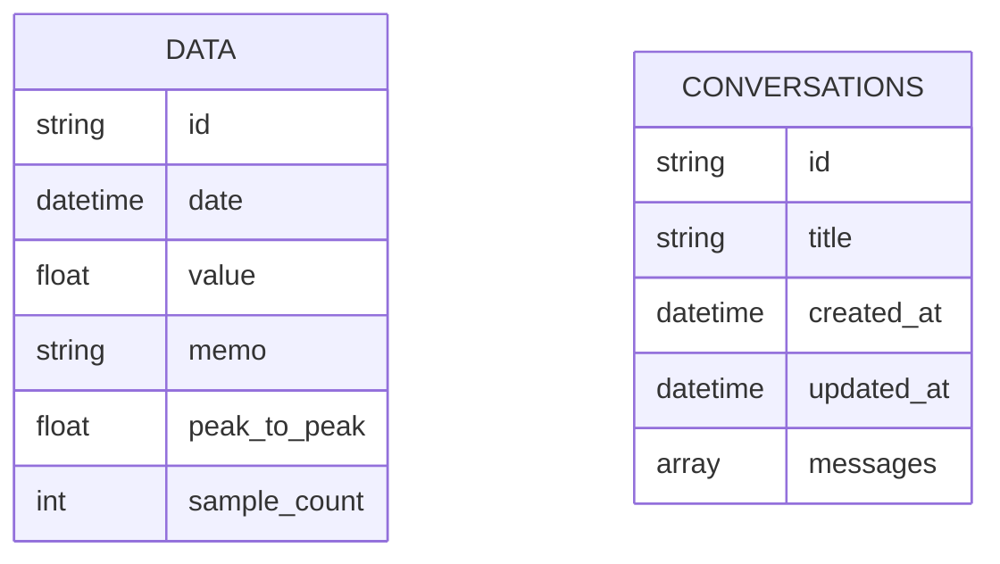

주요 Collection:

- `data`
- `conversations`

### data

교반구동장치의 시계열 특징 데이터를 저장합니다.

대표 필드:

| 필드 | 설명 |
|---|---|
| `date` | 측정 시각 |
| `value` | RMS |
| `memo` | 측정 데이터 메모 |
| `peak_to_peak` | Peak-to-Peak |
| `sample_count` | 특징 계산에 사용된 원본 샘플 수 |

### conversations

사용자와 AI의 대화 기록을 저장합니다.

AI Chat 요청 후 생성된 대화를 저장하고 사용자는 이전 대화를 다시 불러올 수 있습니다.

---

## 10. 프로젝트 구조

```text
M1-2/
│
├── backend/
│   ├── app/
│   │   ├── main.py
│   │   ├── firebase.py
│   │   │
│   │   ├── routers/
│   │   │   ├── data.py
│   │   │   ├── conversations.py
│   │   │   └── chat.py
│   │   │
│   │   ├── services/
│   │   │   ├── data_service.py
│   │   │   ├── conversation_service.py
│   │   │   └── chat_service.py
│   │   │
│   │   └── schemas/
│   │
│   └── requirements.txt
│
├── frontend/
│   ├── index.html
│   ├── style.css
│   ├── app.js
│   ├── config.js
│   ├── generate-config.js
│   └── package.json
│
├── requirements.txt
└── README.md
```

Backend는 Router와 Service를 분리하여 API 요청 처리와 비즈니스 로직을 구분했습니다.

---

## 11. 로컬 실행 방법

### 11.1 저장소 Clone

```bash
git clone <repository-url>
cd M1-2
```

`<repository-url>`에는 실제 GitHub 저장소 주소를 입력합니다.

### 11.2 Python 가상환경 생성

macOS / Linux:

```bash
python3 -m venv .venv
source .venv/bin/activate
```

Windows:

```bash
python -m venv .venv
.venv\Scripts\activate
```

### 11.3 Python 패키지 설치

```bash
pip install -r backend/requirements.txt
```

---

## 12. Backend 실행

Firebase Service Account 및 필요한 환경변수를 설정한 후 Backend 디렉터리로 이동합니다.

```bash
cd backend
```

FastAPI 서버를 실행합니다.

```bash
python -m uvicorn app.main:app --reload
```

Backend 기본 주소:

```text
http://127.0.0.1:8000
```

Swagger UI:

```text
http://127.0.0.1:8000/docs
```

---

## 13. Frontend 실행

새 터미널을 열고 Frontend 디렉터리로 이동합니다.

```bash
cd frontend
```

로컬 HTTP Server를 실행합니다.

```bash
python3 -m http.server 5500
```

브라우저에서 다음 주소로 접속합니다.

```text
http://localhost:5500
```

로컬 개발 환경에서는 `config.js`에서 Backend API 주소를 지정합니다.

```javascript
window.APP_CONFIG = {
    API_BASE_URL: "http://127.0.0.1:8000"
};
```

로컬 환경에서는 FastAPI 서버와 Frontend HTTP Server가 모두 실행되어 있어야 합니다.

---

## 14. 환경변수

API Key 및 Firebase Service Account와 같은 보안 정보는 소스 코드에 직접 작성하지 않고 환경변수로 관리합니다.

### Backend

```env
CODYSSEY_API_KEY=
CODYSSEY_API_URL=https://copa.codyssey.kr/v1/chat/completions
OPENAI_MODEL=gpt-5-mini
FIREBASE_SERVICE_ACCOUNT_JSON=
ALLOWED_ORIGINS=
```

### Backend 환경변수 설명

| 변수 | 설명 |
|---|---|
| `CODYSSEY_API_KEY` | GPT-compatible API 인증 Key |
| `CODYSSEY_API_URL` | GPT-compatible API Endpoint |
| `OPENAI_MODEL` | 사용할 GPT 모델 |
| `FIREBASE_SERVICE_ACCOUNT_JSON` | Firebase Service Account JSON |
| `ALLOWED_ORIGINS` | Frontend CORS 허용 Origin |

배포 환경의 `ALLOWED_ORIGINS`에는 실제 Vercel Frontend Origin을 포함해야 합니다.

예:

```env
ALLOWED_ORIGINS=http://localhost:5500,http://127.0.0.1:5500,https://mixer-vibration-ai-frontend.vercel.app
```

### Frontend

Vercel에서는 다음 환경변수를 사용합니다.

```env
API_BASE_URL=https://mixer-vibration-ai.onrender.com
```

배포 시 `generate-config.js`가 환경변수의 값을 이용하여 Frontend에서 사용할 API 설정을 생성합니다.

API Key와 Firebase Service Account 정보는 Git 저장소에 포함하지 않습니다.

---

## 15. 배포 구조

개발 환경과 운영 환경은 다음과 같이 구성됩니다.

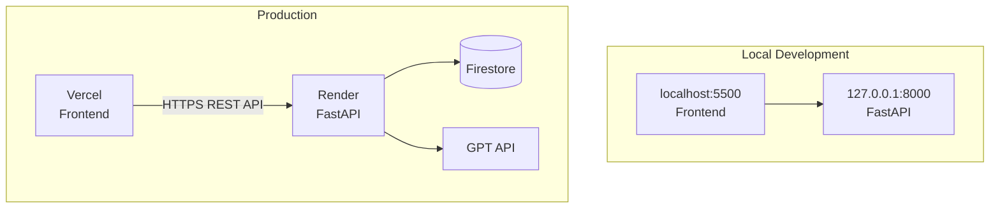

Frontend와 Backend가 서로 다른 Origin에서 실행되므로 FastAPI에서는 CORS를 설정하여 허용된 Frontend Origin만 접근할 수 있도록 구성했습니다.

---

## 16. 데이터 Summary 해석

AI에게 제공되는 Summary는 현재 Firestore의 제조 데이터를 기준으로 계산됩니다.

### 분석 구조

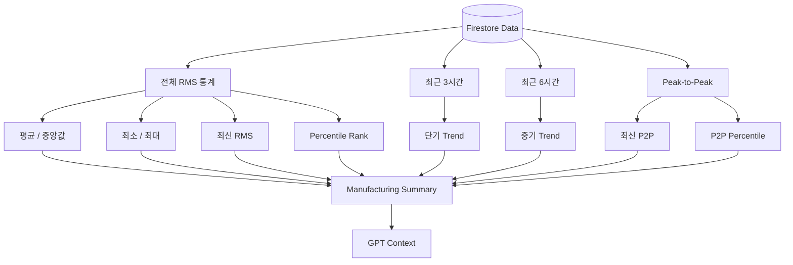

### 현재 RMS 수준

최신 RMS 값이 전체 데이터 분포에서 어느 정도 위치하는지 Percentile Rank를 이용하여 설명합니다.

### 단기 변화

최근 3시간 데이터를 이용하여 단기적인 진동 변화 방향을 확인합니다.

### 중기 변화

최근 6시간 데이터를 이용하여 조금 더 긴 구간에서 진동 변화 방향을 확인합니다.

### Peak-to-Peak

최신 Peak-to-Peak 값과 전체 데이터 내 Percentile Rank를 이용하여 최근 신호의 진폭 범위를 보조적으로 확인합니다.

이 지표들은 현재 보유한 데이터와 비교한 상대적인 분석 결과입니다.

---

## 17. 화면

### AI Chat

현재 제조 데이터 Summary를 기반으로 AI에게 질문하고 답변을 받는 화면입니다.

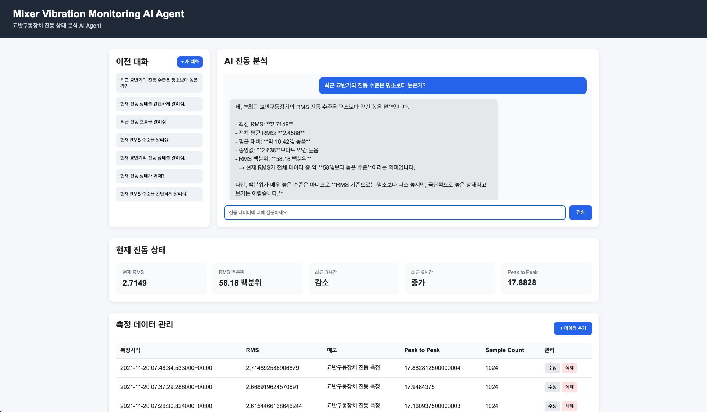

### Data CRUD

진동 데이터를 추가·조회·수정·삭제하는 화면입니다.

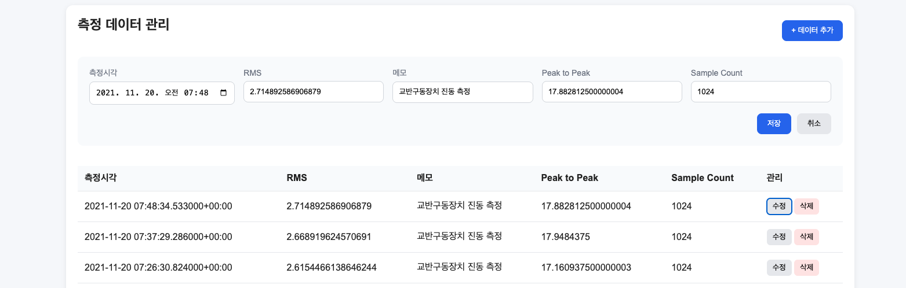

### Conversation History

이전 AI 대화를 저장하고 다시 불러오는 화면입니다.

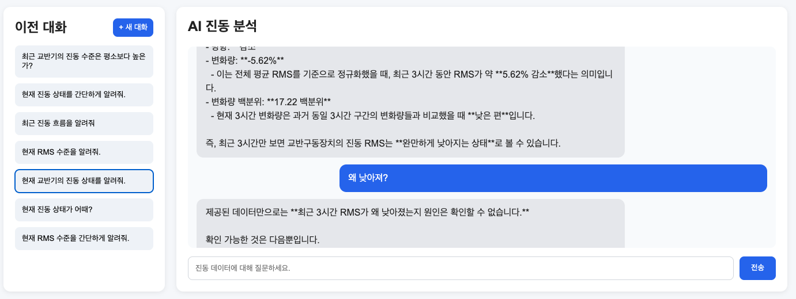

---

## 18. 프로젝트 핵심 특징

본 프로젝트는 단순히 GPT API를 호출하는 Chatbot이 아니라 **제조 데이터 분석 결과를 AI Context로 활용하는 데이터 기반 AI Agent**입니다.

현재 저장되어 있는 진동 데이터를 기준으로 요청 시 Summary를 생성하기 때문에 데이터가 변경되면 AI가 참고하는 정보도 함께 변경됩니다.

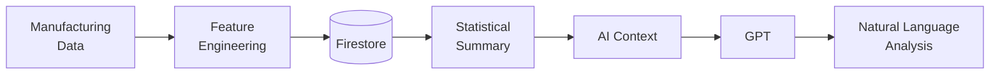

즉 AI가 제조 데이터와 분리되어 동작하는 것이 아니라, 제조 데이터 분석 결과를 Context로 받아 사용자가 이해하기 쉬운 자연어로 설명하는 구조입니다.

---

## 19. 분석 결과 해석 시 주의사항

본 시스템에서 제공하는 RMS, Peak-to-Peak, Percentile Rank 및 Trend는 현재 보유 데이터 내에서 진동 수준과 변화를 설명하기 위한 지표입니다.

높은 Percentile Rank나 진동 변화만으로 실제 설비의 고장 여부, 부품 이상 또는 고장 원인을 확정하지 않습니다.

또한 AI가 사용하는 Summary는 현재 시스템에 저장된 데이터 범위를 기준으로 생성됩니다.

따라서 본 시스템의 분석 결과는 제조 설비의 진동 상태를 데이터 관점에서 이해하기 위한 보조 정보로 활용하며, 실제 설비 고장 판정이나 원인 진단과 동일한 의미로 해석하지 않습니다.

---

## 20. 향후 확장 방향

현재 프로젝트는 RMS 기반의 진동 시계열 분석과 AI Agent를 결합한 구조입니다.

향후 제조 AI 프로젝트에서는 머신러닝 모델을 추가하여 품질 예측, 이상 탐지 및 제조 공정 분석 시스템으로 확장할 수 있습니다.

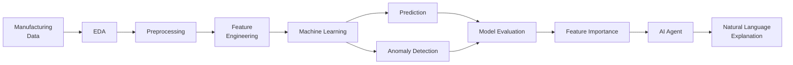

이를 통해 현재의 통계 기반 상태 설명 구조를 다음 단계의 제조 AI 시스템으로 발전시킬 수 있습니다.

### 확장 가능한 분야

- 제조 품질 예측
- 설비 이상 탐지
- 공정 상태 분석
- 예측 모델 결과 해석
- Feature Importance 기반 원인 후보 분석
- AI Agent 기반 제조 데이터 질의응답VV

## 선택과제 - RMS 진동 추이 시각화

사용자가 제조 데이터의 변화를 직관적으로 확인할 수 있도록 RMS 시계열 Line Chart를 추가했습니다.

그래프는 `GET /api/data` 응답을 이용하여 측정 시각을 X축, RMS 값을 Y축으로 표시합니다.

데이터가 추가·수정·삭제되면 기존 CRUD 처리 이후 데이터를 다시 불러오므로 Summary와 함께 RMS 그래프도 자동 갱신됩니다.

### 동작 흐름

```mermaid
flowchart LR
    A["Firestore"] --> B["GET /api/data"]
    B --> C["Date 기준 정렬"]
    C --> D["RMS 추출"]
    D --> E["Canvas Line Chart"]
    F["CRUD 변경"] --> B